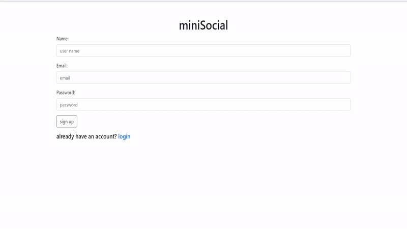

# miniSocial django web app
## miniSocial is  a mini social network built using django python framework as the backend with sqllite as the database engine and django default template system as front end

### miniSocial features
<ul>
<li>create new accounts</li>
<li>login with created accounts</li>
<li>session based login system</li>
<li>post to the feed of every user using the app</li>
<li>view other user posts</li>
<li>filter through posts based on post genre</li>
<li>add your comments to user's posts</li>
<li>view all the comments that was received on your posts</li>
<li>edit the post after posting it</li>
<li>edit your account info</li>
</ul>

### how to run the app

#### install python from main website 

#### install django 
> pip install django

#### at the root directory run 
> python manage.py runserver 

#### the website will run on localhost port 8000 by default
